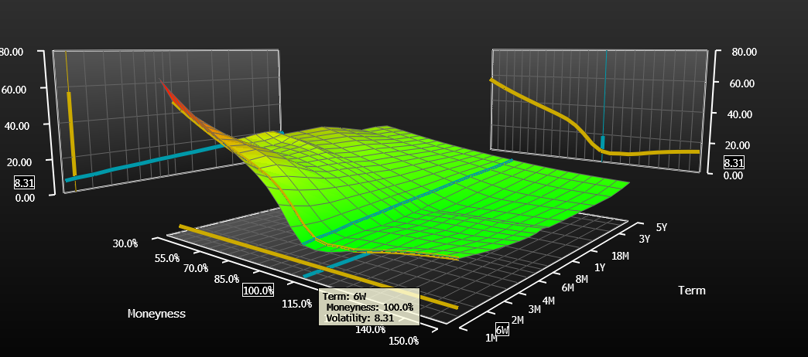
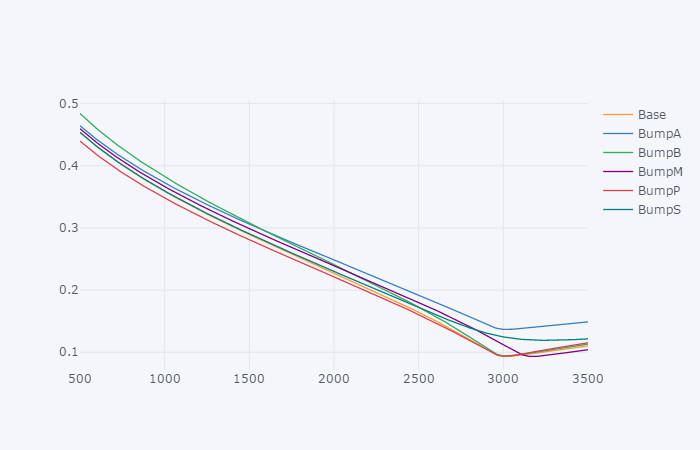

## Background

I assume you are familiar with the Black Scholes framework.

For a stock with spot price `S`, consider a call option with strike `K` and maturity `T` and market price `C`. The implied
volatility `v=v(K, T)` is the number such that `BS(S, K, T, v, r, q)=C` where BS is
the Black-Scholes formula, and the interest rate `r` and dividend yield `q` are known. Note that the forward `F` at time `T` is given by `F=S*exp((r-q)*T)`

The collection `{v(k, t) for all k>=0, t>=0}` is known as the volatility surface, and is an object
of central importance to volatility traders.

As the volatility surface exhibits regularity, both in terms of shape and dynamics,
it is common to parameterize the volatility surface and 'trade the parameters'. By this,
we mean we choose to model the surface as a smooth function `v(k,t)=f(k, t, P)` where
`f` is some function and `P` is a vector of chosen or calibrated parameters.
This may be done in terms of a global parameterization (modelling the 2D surface directly),
or by cross-sectionally parameterizing (parametering across the `k` dimension) for a
discrete set of maturities `t` and interpolating between them. We refer to each discrete cross-section as a 'slice' or 'curve'.

A well known function `f` for accomplishing this is 'SVI' introduced by Jim Gatheral. This is a cross-sectional parameterization so we may drop dependence on `t` for the time being, and moreover, let `x=ln(k/S)` (this is a common coordinate system to work in and one of many measures of 'moneyness' [4](#moneynessdef)). Then

    v(k)^2 = a + b*(p*(x-m)+sqrt((x-m)^2+s^2))

where `a, b, p, m, s` are the parameters. Note that the right hand side of the above is an expression for *variance* (volatility squared). We may say that `a` translates the curve vertically (controls overall level of volatility), `m` translates the curve horizontally, `s` controls the local curvature around `x=m`, `b` controls the steepness
between the two halves, and `p` rotates the curve.

## Problem

You will write a program that takes, as an input, a discrete set of option prices across different strikes at a single maturity, in addition to a spot price. You will compute the implied volatility for these options, estimate the midmarket volatility for each strike, and calibrate a set of SVI parameters that fit this volatility slice.

You may use the programming language of your choice as well as any
'non-financial' packages. That is, you are free to use any third party
optimization, statistics or linear algebra libraries, but you should implement your own functions such as Black Scholes or Forward calculations. Feel free to email (matthew.chivers@rbccm.com) with any questions.

The comma delimited input file quotedata.dat [1](#datasource) shown below requires some explanation

    SPX (S&P 500 INDEX),2684.79,+2.17,
    Dec 28 2017 @ 11:12 ET,
    Calls,Last Sale,Net,Bid,Ask,Vol,Open Int,Puts,Last Sale,Net,Bid,Ask,Vol,Open Int,
    18 Dec 100.00 (SPX1821L100),2552.2,0.0,2535.4,2547.9,0,2673,18 Dec 100.00 (SPX1821X100),0.05,0.0,0.0,0.05,0,10911,
    18 Dec 200.00 (SPX1821L200),2400.0,0.0,2437.5,2449.8,0,2502,18 Dec 200.00 (SPX1821X200),0.15,0.0,0.0,0.05,0,3482,
    18 Dec 250.00 (SPX1821L250),0.0,0.0,2388.5,2400.8,0,0,18 Dec 250.00 (SPX1821X250),0.2,0.0,0.0,0.05,0,80,
    18 Dec 300.00 (SPX1821L300),1499.0,0.0,2339.5,2351.7,0,2,18 Dec 300.00 (SPX1821X300),0.05,0.0,0.0,0.05,0,81,
    18 Dec 400.00 (SPX1821L400),2130.2,0.0,2242.5,2254.5,0,102,18 Dec 400.00 (SPX1821X400),0.1,0.0,0.05,0.2,0,781,

Each row consists of the data pertaining to one strike. The first 7 columns refer to the call option at that strike and the next 7 columns refer to the put option at that strike.
The first of the 7 columns describes that maturity and strike. Here the
maturity is always December 21, 2018 (as well, please note 'today' is Dec 28 2017, as specified in the input file). [2](#optioncode)

### Step 1
Calculate a midmarket implied volatility for each strike.

Given that you have Bid and Ask prices (and hence Mid prices) for puts and calls  for each strike, and you know that with each option price we can find an implied volatility associated with it, you should be able to compute both put and call implied volatilities for each strike. Now, there should only be one implied volatility for each strike, and the put and call vols you find should be similar, but they may not be exact [5](#pcparity). You should choose to combine the put and call implied volatilities somehow to come up with a single implied volatility for each strike. I will leave the choice to you, but do give it some thought and provide justification. Note that deeply in-the-money options tend to be illiquid. Common approaches include equal weighting of put and calls, always using Out of the Money (OTM) options [3](#otmdef), weighting by moneyness (weighted average such that the more OTM an option is, the more weight it is given).

The astute reader may have already noticed one problem - I haven't given you `r` and `q`, which you should need to use the Black Scholes formula. In fact, you can (and should) extract these quantities as market implied parameters. Recall put/call parity which states `C(S, K, T)-P(S, K, T)=exp(-rT)*(F-K)` and `F` is given by `F=S*exp((r-q)*T)` - this identity should be enough to help you estimate `r` and `q`. If you get stuck, you may simply assume `r=0.0200` and proceed to find `q`

### Step 2

Calibrate the SVI parameters `P={a, b, p, m, s}` to best fit the midmarket volatilities found in Step 1.

This can be accomplished as a simple least squares optimization: `P'=argmin_P sum_K((MidVol(K)-SVIVol(K, P))^2)`. One may also wish to do some sort of weighted least squares optimization. Common approaches include weighting by the vega of the strike (which gives more weight to at-the-money options), or inversely proportional to volatility bid/ask spread.
Compare the vols arising form your parametric fit to the mid vols you were fitting. What is the RMSE (root mean square error)? The MAE (mean absolute error)?

### Step 3

Using the parameters from Step 2, you can now compute an implied volatility for any strike. Use this
to come up with a midmarket price for the 21 Dec 2018 2684.79 call. What would your two way market on this option be? That is, quote a bid and ask at which you would be willing to transact.

### Bonus

If you have extra time and want an additional challenge, use your SVI volatility curve to price
the 21 December 2018 variance swap. You can learn about variance swaps here: http://www.emanuelderman.com/media/gs-volatility_swaps.pdf

## Sample Solution
See solution.py

## Footnotes

<a name="datasource">1</a>: Modified output from http://www.cboe.com/delayedquote/quote-table-download

<a name="optmnthcode">2</a>: If you're curious, the symbol in brackets is given by ROOTyyddXkkkk where ROOT is a symbol denoting the underlying, yy denotes the year of expiry, dd denotes the day of expiry, X is a letter code denoting the month of expiry and whether the option is a put or call, and kkkk denotes the strike. The following table describes the letter code mapping

| Month | Call | Put |
|-------|------|-----|
| Jan   | A    | M   |
| Feb   | B    | N   |
| Mar   | C    | O   |
| Apr   | D    | P   |
| May   | E    | Q   |
| Jun   | F    | R   |
| Jul   | G    | S   |
| Aug   | H    | T   |
| Sept  | I    | U   |
| Oct   | J    | V   |
| Nov   | K    | W   |
| Dec   | L    | X   |

<a name="otmdef">3</a>: OTM options are puts for `K < S` or `K < F` and calls for `K > S` or `K < F`. The choice of `S` or `F` varies, as does the choice for `K=S` or `K=F`.

<a name="moneynessdef">4</a>: Other common definitions of moneyness include `x=ln(K/S)`, `x=ln(K/F)`, `x=ln(K/S)/sqrt(T)`, `x=ln(K/F)/sqt(T)`, `d_{+/-}=(ln(F/K)+/-0.5*v^2*T)/(v*sqrt(T))`, and `Delta=N(d1)` where `N` is the normal cdf. Every trader has their favourite.

<a name="pcparity">5</a>: This does not necessarily mean that put call parity doesn't hold, rather the truth of 'Mid' is obscured by the Bid/Ask spread.